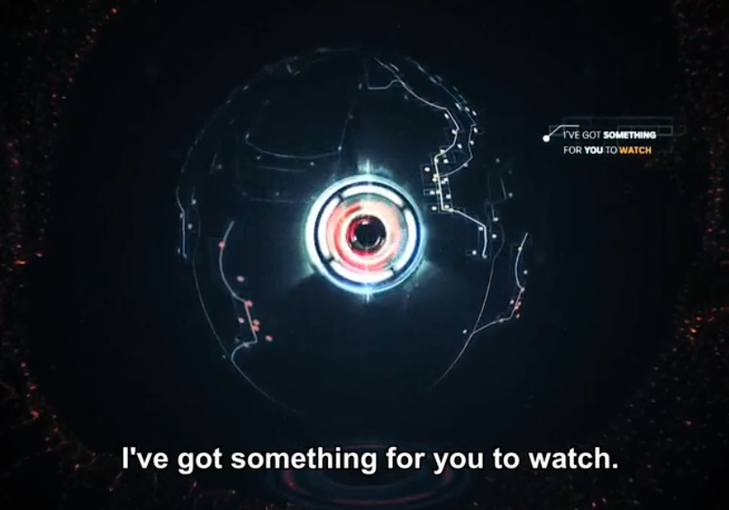
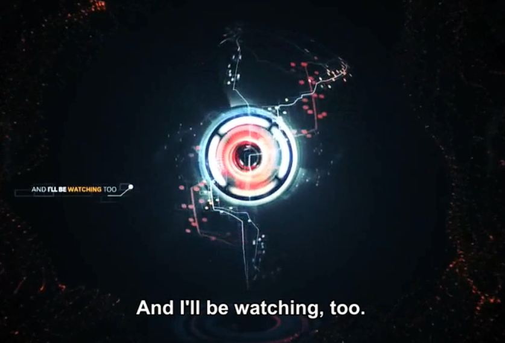
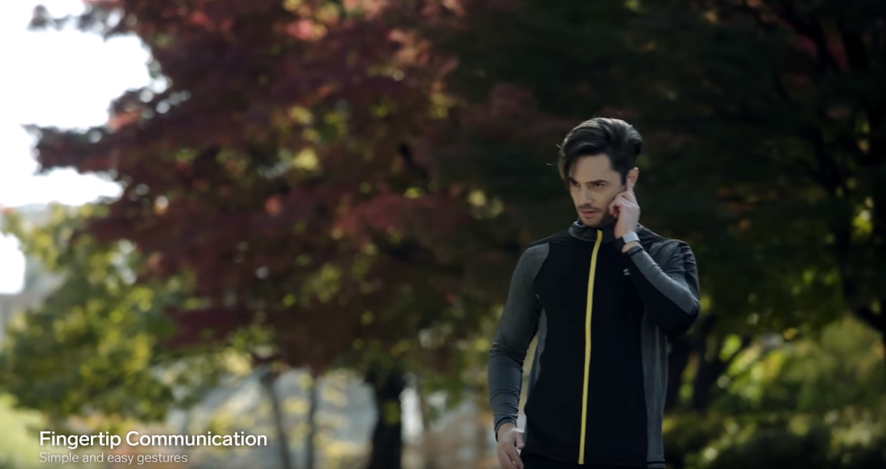

### 科技
[the AI race](https://www.bilibili.com/video/av27430446/)
这是一部纪录片，谈论从货车司机到律师再到医疗，机器和人对工作的竞争，通过这部片子大家能真真切切地感受到机器替代人是真实的事而且越来越近。我也感到一种威胁，不仅从替代性，还有机器对我们的监视。正如里面开头说到的一句话“I get something for you to watch, and I'll be watching too.”
看完这部纪录片，我才开始思考面对这次技术革命，我要开始付出哪些行动。

[仿生学机器人](https://www.youtube.com/watch?v=Oqq5tgday_w)
10分钟的短视频，介绍了诸多动物仿生学机器人，蝴蝶，蜻蜓，蚂蚁，海豚，狗，袋鼠。你会发现这些机器动物如果披上动物的皮囊，已经和真实的动物没什么区别了。

[厨房黑科技](https://www.youtube.com/watch?v=lwA7NDd3fn0&t=325s)
作为一个喜欢厨房的男生，自然对能够对方便切菜的工具感兴趣，我想一把菜刀也不能方便切任何菜吧。请欣赏这些设计奇妙的厨房黑科技。

[sgnl - fingertip communication](https://www.youtube.com/watch?v=Jz9LwufJBQQ) 这个手环很有趣，不用带耳机，用手指按住耳朵就可以听，通过骨传导把声音传到耳朵里。不过这样给人有点像警察在秘密通话的印象。

### 历史
《二混子：半小时漫画中国史》-汉代
通过这本书让我对历史感兴趣。主要看了刘邦和项羽的斗争，特别好奇的是像刘邦这种45岁前就是个混混，还到处赊账，借钱，穷困潦倒的人怎么就一跃成为了帝王，我很想读读这里面的小故事，比如和萧何，张良和韩信的故事

### 金融
主要学习企业收购，像杠杆收购，兼并收购，恶意收购，抵御野蛮人的方法，仔细研究了下“宝万之争”的案子。
这里要提醒一下的是，在遇到恶意收购的案子的时候，一般被收购企业都是好企业，可以成为重点投资的对象。

### 对学英语新的认知
以前学习主要是为了能进入外企，或者能说英语显得逼格高一点。在近一个月的学习中，我接触越来越多的英语资源，发现了好多好玩有趣的东西，能看到更先进的科技，更方便的生活技巧。我不希望当我想了解一件事物的时候，语言会成为我的屏障，让我放弃去探索，去好奇。我意识到英语成为了我通向一个更宽广，更先进世界的大门，我一定要推开它。
在这里也恭喜自己坚持学习英语两个月了。
