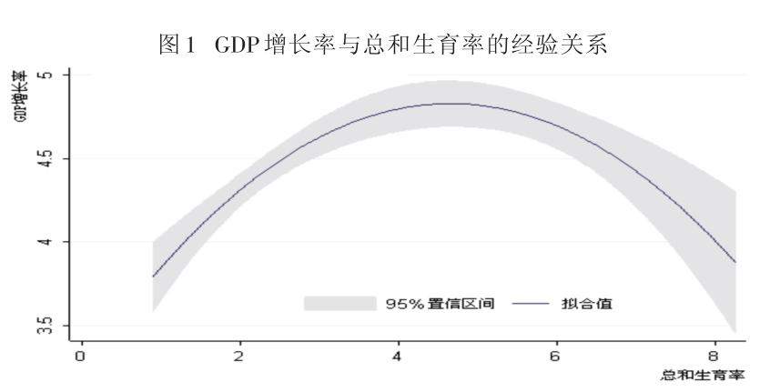
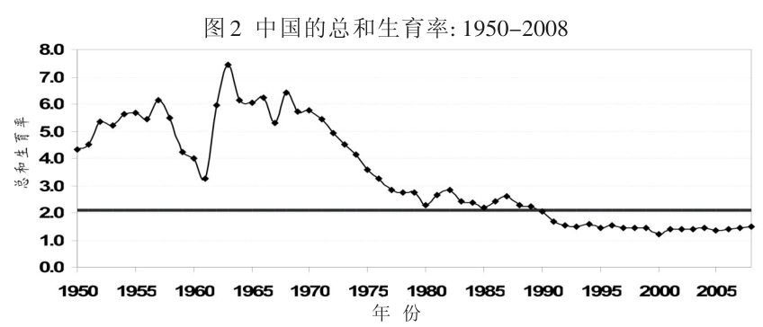
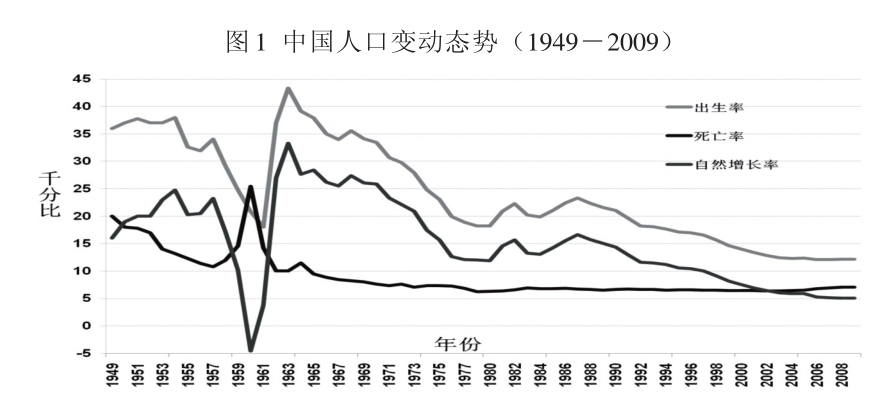
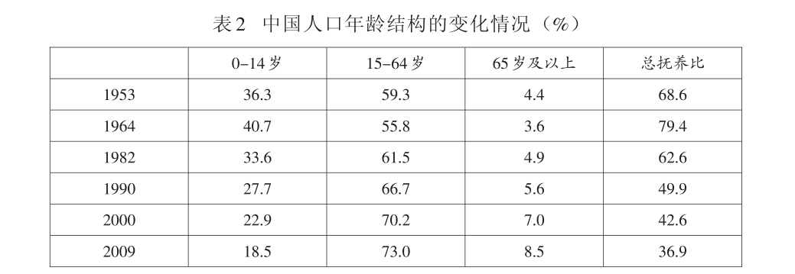
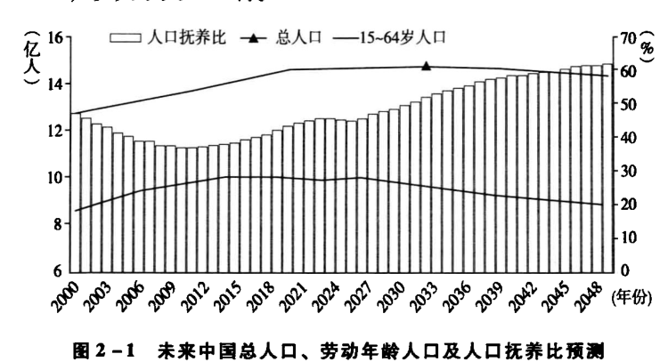
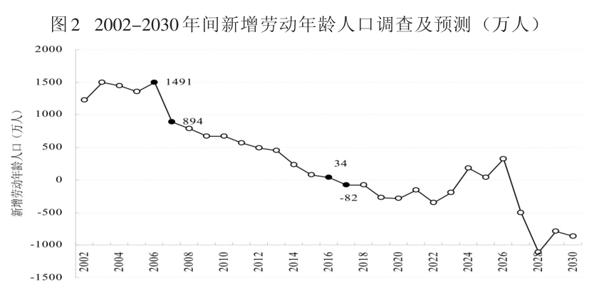
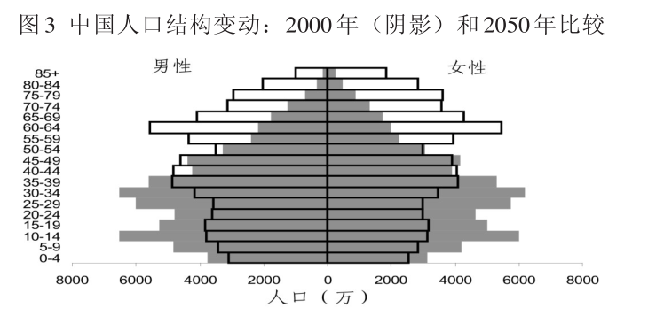

### 中国人口趋势
#### 生育率和GDP的关系
按照发达国家的生育率和GDP变化，可以得出一个规律，生育率的变化和GDP的发展呈现一种倒U字型的关系

人口转变一般都需要经历三个个阶段，第一阶段，高出生率、高死亡率、低增长率的；第二阶段，高出生率、低死亡率、高增长率；第三阶段：低出生率、低死亡率、低增长率。

#### 中国出生率和死亡率的趋势

从这两个图可以看出，出生率虽然中间有波动，但是总体来看是呈现下降趋势，而死亡率下降较为平缓。
可以看出在1990以前，由于下降较为平缓的死亡率和较高的出生率（虽然出生率在下降，但仍保持高出生率），这就使得年轻劳动力是呈上升趋势，抚养比理应就会下降。
#### 生育率变化和抚养比的关系  

可以说正是由于抚养比下降，给中国的改革开放后的经济腾飞注入了活力。中国的人口转变形成了有利于经济发展的人口结构，劳动年龄人口占总人口比重的不断上升以及人均受教育水平的提高，使得中国人口的总体生产性不断增强，并推动了经济的快速增长。  
  
但是由于保持较低的死亡率和低出生率，人的寿命会不断延长，老年人会越来越多，这个时候抚养比又开始逐渐上升。年轻劳动力就会下降，就会出现“民工荒”。

#### 人口转变与劳动市场的关系

由于快速的人口转变，目前新增劳动年龄人口数量正经历着急剧的下降，该图中的两个时间点新增劳动年龄人口的变化值得我们特别关注。
在人口结构尚处于人口红利期时，劳动力成本已经呈现出加速增长的趋势，随着低生育率对劳动力市场影响的效应进一步显现，劳动力成本的上升也会加速。
由于人口红利逐渐消失，劳动力成本的逐步上升不可避免。  
所以未来中国的人口结构就会发生变化

#### 中国人口结构变动

可以发现，中国人口年龄比重的倾斜将逐渐向60岁以上。
