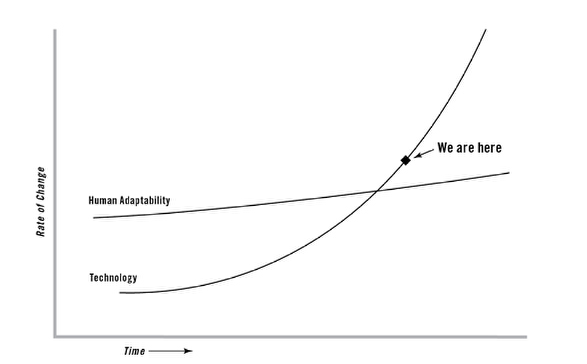

### 英语
我现在学习英语主要是在YouTube上，上面有很优质的channel，下面我分享我比较喜欢的。
##### 背单词
 [7ESL](https://www.youtube.com/channel/UCPDQgXju7hqEGBwzLIeI7Zw)，这个频道背单词的特点就是分类，图片。
1. 用图片背单词。大多数背单词都是先背单词，然后还要记中文意思。我更建议的背单词方式是通过图片，也就是说你看到一个物体，你脑子里第一反应不是它的中文意思，然后再翻译成英文，而是马上就反映它的英文表达，中间就缺少一个中文转换。
2. 更重要的还分类，比如说food, time, body, math, animal

##### 公开课
[JamesESL](https://www.youtube.com/channel/UCwA7Aepp7nRUJNa8roQ-6Bw): 这是我最喜欢的channel，因为这个老师教课特别风趣，幽默，讲的东西也特别到位。而且他的画画水平很高，经常在board上画漫画，这能帮助你理解。
[English lessons with Adam](https://www.youtube.com/channel/UC_0NfufarVw04vDfWFm8z_Q)：这位老师就主要讲知识点了
[Learn English with EnglishClass101.com ](https://www.youtube.com/channel/UCeTVoczn9NOZA9blls3YgUg):这位老师主要通过直播的方式讲课，如果你喜欢这种方式可以subscribe。
[Speak English with Christina](https://www.youtube.com/channel/UCtWyH1MB_A3OggdzoGtkeQA): 想必有些人刚开始全英文听这些课比较困难，我推荐这个，这位老师发音特别清晰，也比较慢，你不怕跟不上老师的语速。
还有像[Learn English with Let's Talk](https://www.youtube.com/channel/UCicjynhfFw2LiIQFnoS1JTw),[Learn English with Emma](https://www.youtube.com/channel/UCVBErcpqaokOf4fI5j73K_w)
这些都是特别优质的资源，你可以多看几个，挑出特别喜欢的老师的上课风格。
学习英文我建议还是要在全英文的环境下，不要有任何中文，在记知识点时也尽可能不要想中文意思，而是想图片或者场景。

### 金融
这周主要学习了中国金融机构体系中的银行。
* 中央银行：这是一个能印钱的地方。我这打个比喻中央银行就是巨大的水库，货币就是水，它有两个大闸门，存款准备金，基准利率。它也是最后贷款人角色。
* 商业银行：就是送水站，包括大型商业商业银行和股份制商业银行，以及大家经常看到的XXX城市商业银行
* 货币基金：银行间的短期借款，就是一两天的时间。余额宝其实就是货币基金。
* 存款保险制度，防止挤兑，银行破产。

### 读书
##### 《Thank you for being late》
让我感兴趣的是这个图
X轴是时间，Y轴是变化率，那两条线代表技术进步的速度和人适应技术的速度。在交叉点之前，技术进步是很慢的，一个新的技术出来，人能很快适应。也就是如果一个生活在十一世纪的人穿越时空到十二世纪，即使技术进步了，他也能很快的适应。但因为技术站在自己的肩膀上，技术进步得越来越快。当然，人的适应能力也在提高，可是相比技术，是很慢的。一旦过了一个交叉点，人会发现已经不能适应技术的进步，要学习越来越多的东西，越来越难的知识。这就会造成很多问题，越来越多的人失业，越来越多的文盲（21世纪要重新定义文盲）。

### 其他
[李开复在TED](https://www.ted.com/talks/kai_fu_lee_how_ai_can_save_our_humanity/transcript)
他讲的关于人工智能怎样拯救人类，这里面的观点他在很多场合都讲过，没多少新颖的地方。吸引我的是他分享了当他得知自己患肿瘤后，他知道只有几个月生命时间的时候，意识到生命的重要性，他开始更多的回归家庭。
人就是这样，只有去接近死亡的时候才会意识到生命是什么东西，人一生什么才是最重要的，是爱和健康。
我今年身体的毛病也特别多，毕业后2016,2017都没进过医院，没有任何医保消费记录，而今年2018年，突然多起来，快十次了，一会长时间拉肚子，一会身上长了红痘痘，一会要割掉脸颊上留了7年的疮。去医院次数多了，也在开始反思平常的饮食习惯，对家人的忽略。希望大家都能好好锻炼身体。
