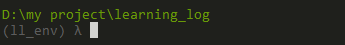
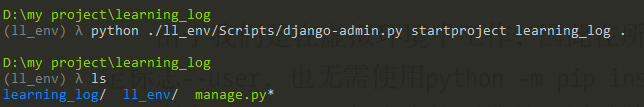
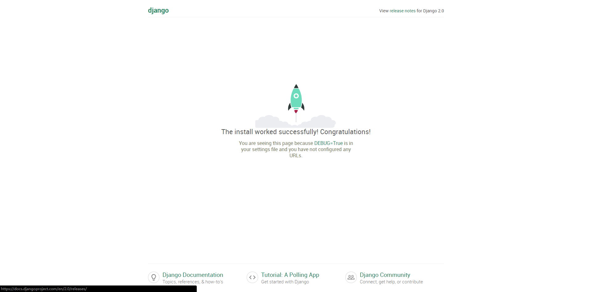

#### 搭建项目(win7, python3)
1. 新建一个文件夹learning_log
2. 建立虚拟环境
```linux
python -m venv ll_env
```
  运行模块venv， 并使用它来创建一个名为ll_env的虚拟环境
  虚拟环境是系统的一个位置，可以在其中安装包，并与其它python包隔离。
3. 激活虚拟环境
```linux
 ll_env\Scripts\activate
 ```
 此时命令行会出现（ll_env）表示已激活
 
4. 安装Django
```linux
 pip install Django
 ```
5. 在Django中创建项目
 ```linux
 python ./ll_env/Scripts/django-admin.py startproject learning_log .
 ls
 learning_log ll_env manage.py
 ```
 注意加句号
 
6. 创建数据库
 ```linux
python manage.py migrate
 ```
7. 运行
```linux
python manage.py runserver
```
此时在浏览器输入localhost:8000就会看到下面的页面
 
