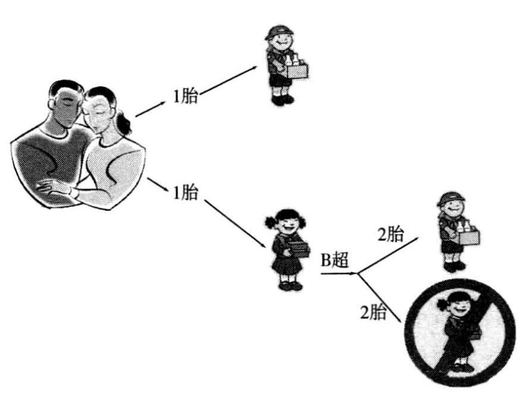

#### 人多不碍事
人口论有两个主要理论：（1）马氏人口理论；（2）罗氏理论
他们之间的区别是：马氏理论资源是有限的，而人越多，每个人所分得的资源就少。一旦超过一个界限，资源就会短缺，会造成社会不稳定。
罗氏理论相反，他认为人越多，就有更多的科技创新产生，反过来被所有人使用，又会创造更多的资源。所以人越多是一件好事。  简单的说就是马氏人口理论认为蛋糕是一定的，人越多，每个人分得的就少；罗氏理论认为人越多，创造的蛋糕也越多，不需要担心资源急缺的问题。
马氏人口理论只适用于工业革命之前以农业为主的人类经济时代。农业经济发展靠土地，人口增多，平均分得的土地就少了，所以人口增多，会拖累经济。而到了现代，农业经济已经处于次要地方，主要以工业和服务也为主，这两方面技术提升比人口增长快得多。而且还在开发新能源，也就是说土地或者资源对经济发展的约束力会越来越低。反而技术的进步，经济的发展需要越来越多高素质的人。所以人才是根本。

#### 计划生育的后遗症
农业社会的人口高出生率，高死亡率向工业社会的低出生率、低死亡率转变，而生育率的变化要滞后死亡率变化10~30年。中间就有个阶段是高出生率，低死亡率，就会引起人口激增。所以现在中国人口的增加不是生得太多，而是老得太多。
在未来10-20年，中国的人口结构会发生大的改变，像现在的日本，老人数量会攀升。
造成的危害是巨大的：
1. 高管的职位都被老人占据着，年轻人晋升的机会降低，从而造成年轻人看不到希望，创造力，努力奋斗的精神都会下降，社会的创新活力也会下降。
2. 现代的老人抚养不再是以前的“养儿防老”模式，而是靠养老金。养老金不是你年轻缴的钱，而是现在年轻人缴的社保，也就是说是现在的年轻人在养现在的老人。如果老人增加，势必会加重年轻人的负担，各种税收，社保也会增加。压力一增加，年轻人的生育压力也会增加，这样就进入了一种死循环。
3. 在政策制定时，由于老人占主导，他们是既得利益者，就会出现政策偏向。

从人口变化来看，中国经济的增长后劲乏力。

#### 计划生育带来的性别不平衡
在执行计划生育那个时候，经济发展处于初期阶段，人们的受教育程度普遍不高，再加上“重男轻女”的文化，人们更愿意生男孩。
那一孩政策是怎么影响男女生育比率呢？在没有生育政策约束的情况下，人们的性别偏好和“男根”文化是可以通过一定孩子的数量达到满足的，如直到生男为主。一旦实行“一孩”政策，生男的愿望就不能得到满足。由于人们心理不平衡，还有互相之间的攀比，更加强化了追求男孩的愿望。人们就只好通过瞒报，性别鉴定（B超技术的普及）等非常规手段来达到性别偏好的满足。

在这种情况下，女性就成为稀缺资源，剩男和晚婚会出现的越来越多。如果男性找不到伴侣，心理就会出现偏激，对社会不稳定产生极大风险。
最近滴滴事件背后的部分原因就是男女比例失衡（其实是其他因素共同作用的结果）。这些司机的心理存在问题，对社会有极大的不满足，就会在乘客身上发泄，从而就会有那么多事件发生。人们的注意力都集中在滴滴不负责任的表现，却忽略了背后反映的是社会不稳定因素造成的，那什么又造成了社会不稳定呢？

#### 结论
庞大的人口规模、合理的人口结构、不断提升的人口素质，在良好的政治经济制度之下是科技创新的源泉，是人类社会发展的动力。
随着更多新能源的开发，多个国家采取“量化宽松”政策，资源将不再是问题，钱会越来越不值钱。而“人”才是最重要的，21世纪国家之间的竞争是人才的竞争。所以中国人不是生得太多，而是生得太少了。
