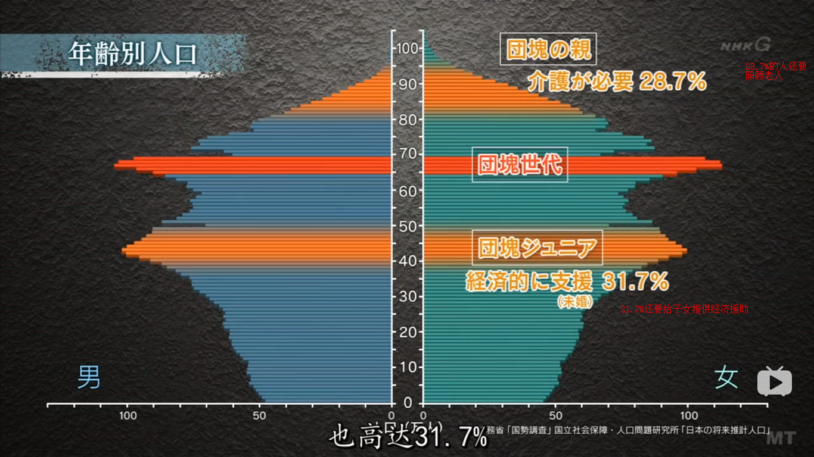
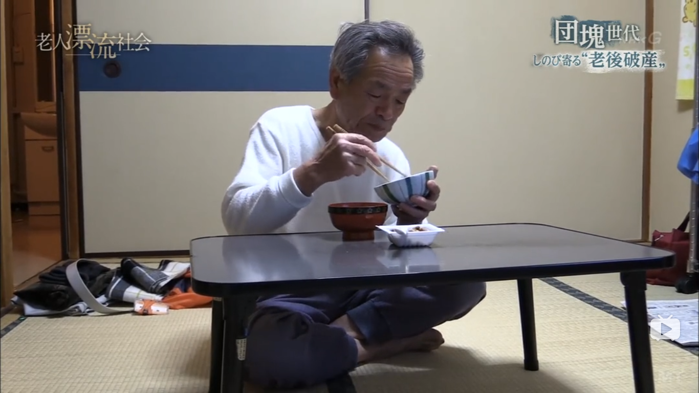
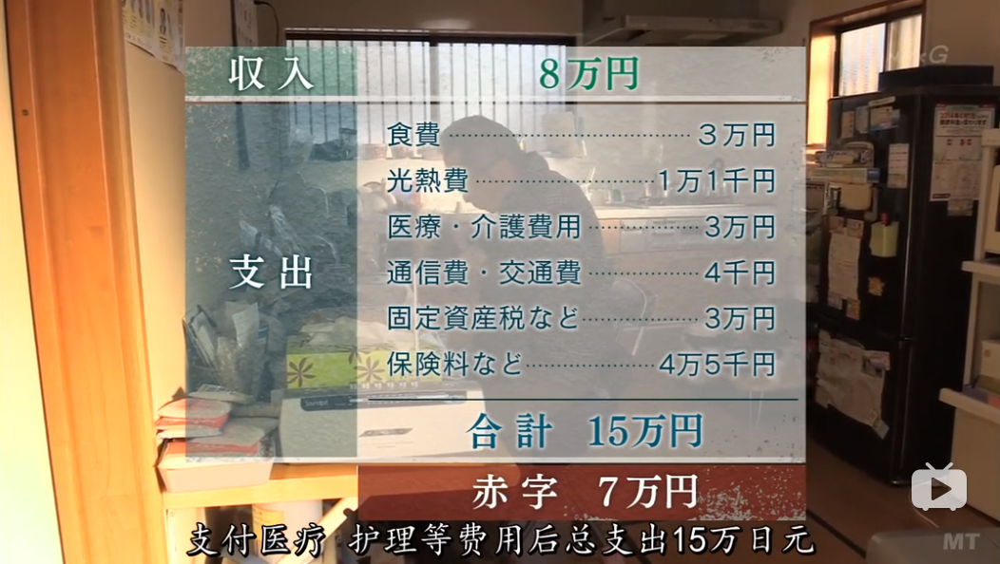
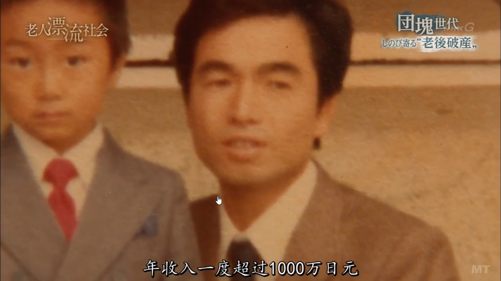
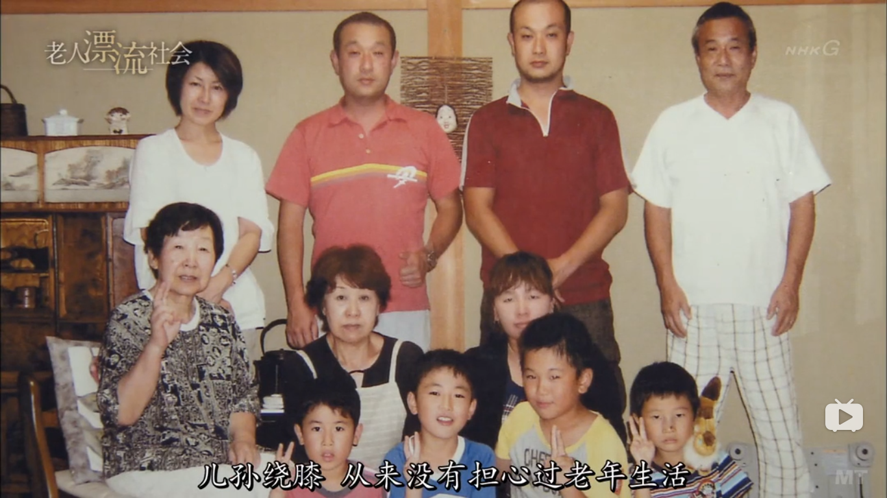
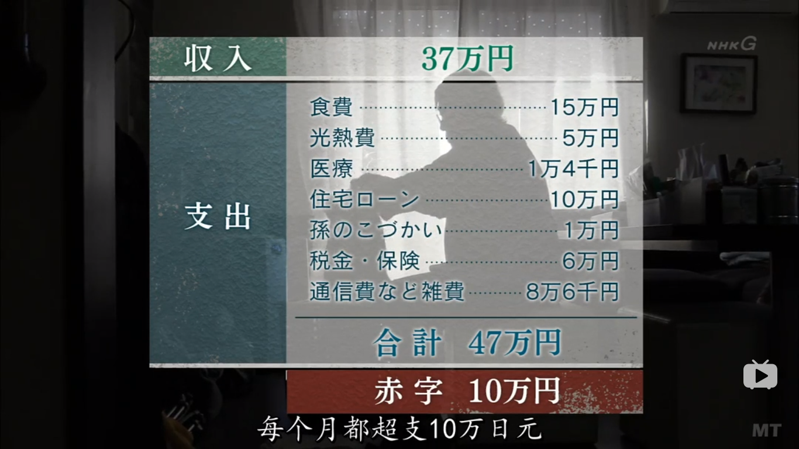
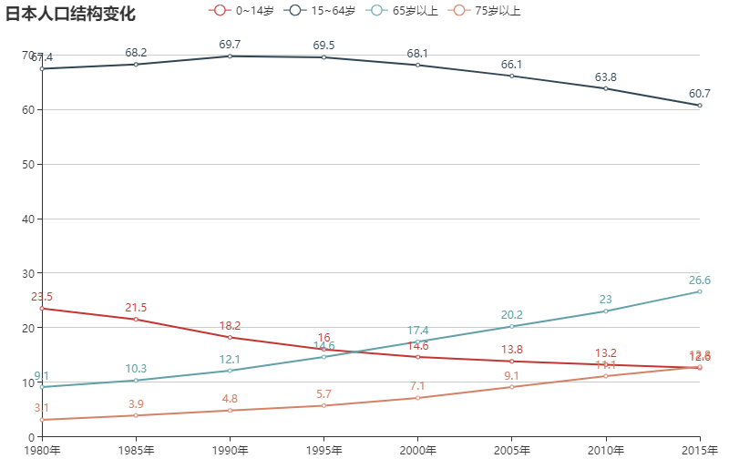
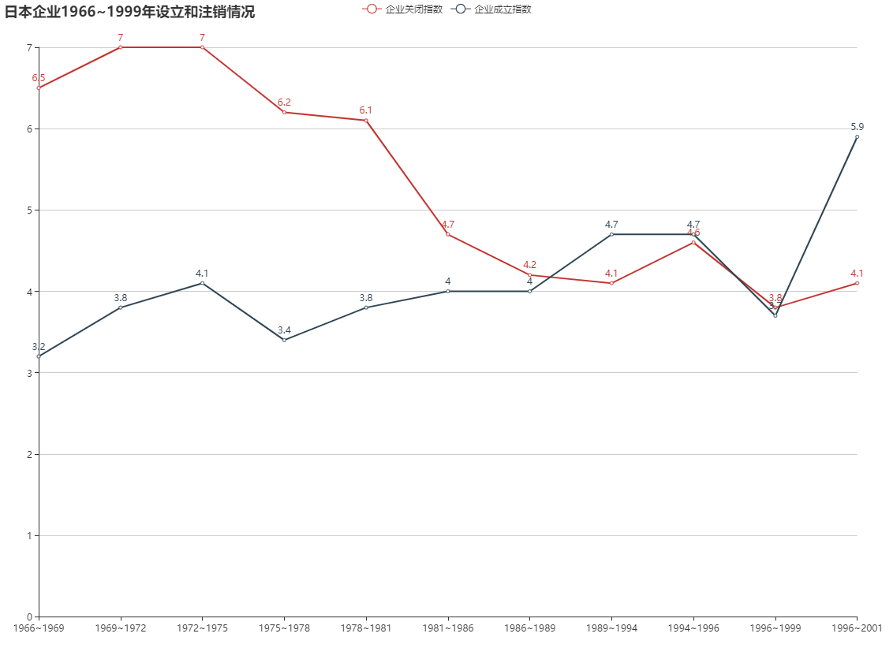

#### 退休老年破产
日本经济是在1956年之后开始腾飞的，我们把为经济高速增长的这个时期付出贡献的青年人叫做“团块世代”。这代人也被认为富裕一代。在2007年，“团块世代”相继退休。
这一代人退休之后照理说过上富足的老年生活。但现在很难断言。
现在看看日本的人口结构

从数据来看团块世代处在上有老下有小的夹心层。
##### 案例一：孤独老人
我们来看看一个老人，退休，已离婚，有一个97岁的母亲在外面的护理院生活，39岁儿子在外地生活。

以下是老人的开支情况

可见入不敷出
这位老人在年轻时属于高收入者，年收入一度超过1000万日元，

那时根本没有想过老年生活会有困难。后来由于经常加班，导致离婚。而他在43岁后由于泡沫破灭，公司裁员，不得不辞职，后来就干些零零散散的非正式工作。到正式退休的年龄，也没有多少存款，100万日元不到。生活十分拮据，不得不在65高龄重新工作。

这就是在年轻时没有存下足够存款的老年生活真实写照。
##### 案列二：子孙满堂
再来简单看一下一户儿孙满堂的家庭

老人68岁，年轻时是工薪阶层，现在退休，仍在打工。因为经济低迷，一个36岁的儿子很难找到工作，只能做些零散的工作，没有稳定的收入，妻子也去世了，现在带着两个孩子投靠父母，和老人同住。老人还要赡养89岁的母亲，每周4天寄养在日间护理中心。也就是说现在一家6口人住在一起

老人现在有200万日元的存款，现在来看，两年后就会破产。  

以上两个例子我想和大多数一样，年轻时都是工薪阶层，有房有车有孩子，到退休时，但由于社会老龄化，经济陷入低迷，上有90岁高龄的父母，下有无法有稳定收入的子女，生活仍然拮据，面临破产危机。
想想现在的中国，经济，老龄化，生育率，是不是有很多和日本过去很相似，那我们伴随中国经济腾飞的80后，90后日后的状况呢？

#### 看看数据

可以看出65岁以上退休老人越来越多，而出生人数还在下降。
老年人增多了会引起什么问题呢？
1. 政府必须继续加重日益减少的工作人口的税负，用来抚养日益增多的老人，年轻人的财政压力增大。
2. 人口老化，企业中老人的比例越来越高，原本富有创造力的日本企业逐步变得保守。年轻人的提升空间越来越小，企业的创新能力大打折扣。
3. 僵化的人事制度导致年轻人不敢冒险创业，因为一旦失败，就很难再找到工作
4. 老年人的犯罪率升高。因为没有足够的养老金，老年人只好想出进入看守所安度晚年。

从这些可以看出现在的日本政府是为老人服务的，不是为孩子服务的。日本现在不仅老人多，而且老人参与投票的比例要远远高于年轻人。由于老人选票在选举中占绝对优势，政策自然会向老年人倾斜，各种社会资源和福利也会向老人倾斜，不会推出更优惠的鼓励年轻人生育的政策。

#### 看中国
中国将来也会像日本一样，面临严重的人口老龄化，甚至更严重，因为中国人口结构的变化受到“计划生育”人口政策强势调整。日本是进入发达国家水平才进入的老龄化，而中国还未达到发达国家水平就已经进入了老龄化，也就是“未富先老”。因为人口政策还带来性别比的极度不平衡。这些人口问题必将给中国未来的发展带来风险。
中国现在也经历了30年改革开放的高速发展期，现在经济已经下滑，也已经进入了老龄化国家，和日本的情况极其相似，以上谈到的案列和问题也将是我们面对的，那我们有什么应对措施呢？
我提出的应付政策是：
1. 在工作年龄多存钱。
2. 学会投资理财，卖保险。因为老的时候仅仅靠养老制度和子女肯定是不够的。
3. 学一门到老了也可以用的技术，也就是年龄越大越值钱。
