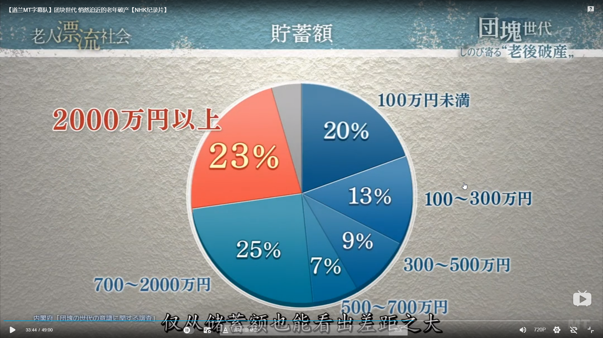

#### 退休老年破产
日本经济是在1956年之后开始腾飞的，我们把为经济高速增长的这个时期付出贡献的青年人叫做“团块世代”。这代人也被认为富裕一代。在2007年，“团块世代”相继退休。
这一代人退休之后也应该过上富足的老年生活。但现在很难断言。

从数据来看还有相当比例的人退休之后仍要照顾老人和资助子女。
我们来看看一个老人，退休，已离婚，有一个97岁的母亲在外面的护理院生活，39岁儿子在外地生活。

以下是老人的开支情况

可见入不敷出
这位老人在年轻时属于高收入者，年收入一度超过1000万日元，

那时根本没有想过老年生活会有困难。后来由于经常加班，导致离婚。而他在43岁后不得不辞职了，后来就干些零零散散的非正式工作。到正式退休的年龄，也没有多少存款，100万日元不到。生活十分拮据，不得不在65高龄重新工作。

这就是在年轻时没有存下足够存款的老年生活真实写照。
再来简单看一下一户儿孙满堂的家庭

老人68岁，年轻时是工薪阶层，现在退休，仍在打工。因为经济低迷，一个36岁的儿子很难找到工作，做些零散的工作，没有稳定的收入，妻子也去世了，现在带着两个孩子投靠父母，和老人同住。老人还要赡养89岁的母亲，每周4天寄养在日间护理中心。

老人现在有200万日元的存款，现在来看，两年后就会破产。  
来看看不同存款的人数占比

以上两个例子我想和大多数一样，年轻时都是工薪阶层，有房有车有孩子，到退休时，但由于社会老龄化，经济陷入低迷，上有90岁高龄的父母，下有无法有稳定收入的子女，生活仍然拮据，面临破产危机。
想想现在的中国，经济，老龄化，生育率，是不是有很多和日本相似的地方，那我们伴随中国经济腾飞的80后，90后日后的状况呢？

#### 年轻生育下降
