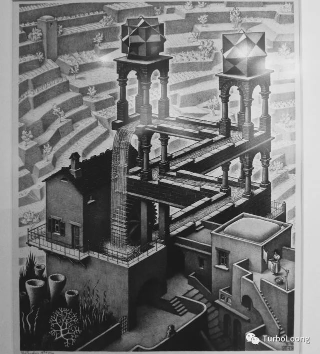
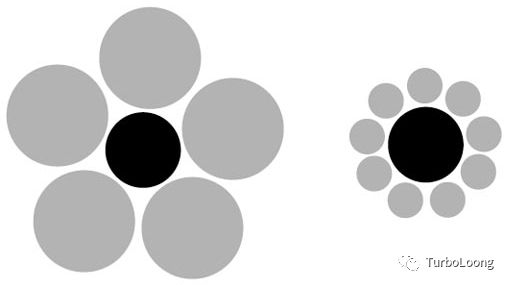
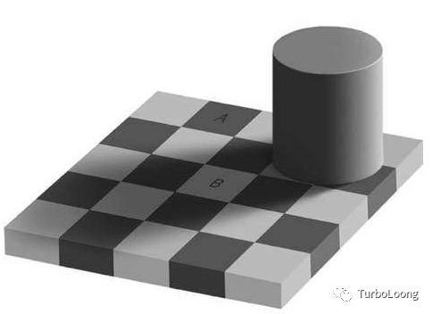

### 免费的代价

我先给大家出两道选择题。

第一道选择题。现在有两块巧克力，一块A原价50美分，现在卖15美分，另一块B原价10美分，现在卖1美分。你会买哪一块？然后把A卖14美分，B免费拿。你又会拿哪一块？

第二道选择题。一张10美元的亚马逊网络书店的礼品券--免费，另一张20美元的礼品券--但你要付7美元。你选择哪一个？

第一道选择题你是不是先选的A，在都降价后选B。第二道选择题是不是选免费拿。其实第一道选择题在降价后仍然A依然比B物超所值，第二道选择题20美元的礼品券花7美元，净得13美元，而免费拿才净得10美元。这就是免费的威力。

即使从成本-效益角度分析，应该选择A，选择20元的礼品券，可为什么我们会选择免费？因为选择免费就不会有显而易见的损失，选择不免费的就会有风险，而这又是“损失厌恶”。免费最大的问题在于，当我们在免费和另一件商品之间，在有利和不利挣扎时，忘记了不利的一面，给我们造成一种情绪冲动，从而引诱我们作出不明智的决定。从2到1和从1到0虽然理论上减去的数量都相同，可0在我们心中的位置似乎有点不同。

*永不停下的水*

### 感情的偏好

我先说一句话大家是否感同身受，“一个人的死亡是个悲剧，但100万人的死亡不过是个统计数字”。为什么我们选择帮助某个人，却漠视许多人的痛苦？三点原因：（1）“密切度”，对绝大多数人我们都不认识，我们对空间和心理上接近的人产生更深的同情感；（2）“生动感”，我们对处境和感受描述的越细微，就越会引起他人的共鸣；（3）“杯水车薪”，在数以百万计亟需救助人面前，个人的力量甚小，不禁会发出一句感叹，“这有什么意义？”。

那问题来了，我们又怎么才能激励人们向重大灾难捐款呢？

同样大小的黑色圆

### 所有权的个性

有一群球迷，一些人买到票，另些人没有。询问买到票的人如果可以出售这张票能接受的价格，又问没有买到票的人，从有票的人（现在就是黄牛）买票能承受的价格。实验结果是买到票接受的价格远远高于没有票能承受的。

这个实验展示了人类本性的三大非理性。第一个是，我们对已经拥有的东西迷恋到不能自拔 ，买到票的人会幻想看球赛时的激动。第二个是，总是把注意力集中到自己会失去什么，而不是会得到什么，有票的人只注意到自己会失去看球的经历却不想象卖掉球票可以赚钱，也可以买其他的享受。第三个是假定别人看待交易的角度和我们一样，有票的人以为没票的人也会有和自己一样的激动，其实有可能没票的人正在想象可以把买票省下的钱去买一件帅气的衣服。

我们购物时常常会碰到“试用”，“30天不满意全额退款”。这些销售手段也是同样的道理。一旦过了试用期，就会产生“买到票”的心理。

对于拥有的物品是这样，对拥有的人是不是也是这样？

A和B其实一样的颜色

