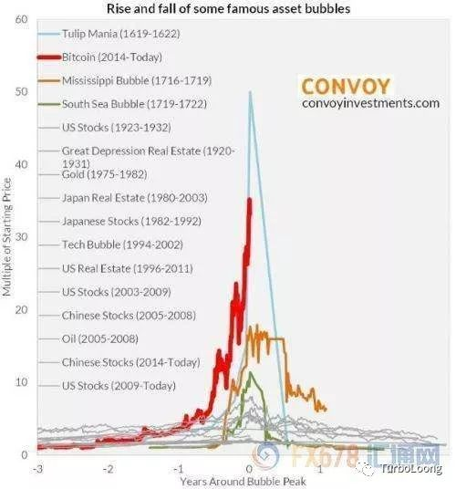

　　最近金融界发生了两件大事，一件事是钱宝网的张小雷自首，一件事是比特币的疯涨。同事，媒体，大家都在热议比特币。

　　我先给大家看一张图

　　这是历史中金融泡沫的前十名事件。排在第一位的金融泡沫是发生在400年前的荷兰，郁金香是荷兰的国花。这个泡沫在多个电影中提到过，比如说

　　男演员指向的墙壁上挂的画就是郁金香。当时一粒郁金香种子炒到了两套联排别墅。这是人类第一次因为投机和狂热造成的泡沫。

　　泡沫造成的原因有很多，有技术进步带来的，离我们最近的是20世纪90年代后期的全球互联网股票泡沫。技术的进步给投资者带来对未来的无限憧憬，所以大量的热钱进去。更远的就是英国铁路的狂热。回到现在，人工智能，大数据。我并不是说科技是泡沫，我是想说科技带来的泡沫。我曾经打开支付宝的理财页面，首页就是各种围绕“人工智能”的基金，年化收益率能达到45%。如果乞丐、擦鞋匠、美发师和美容师都能告诉 你该如何发财时，你就该提醒自己，最危险的幻觉在于相信人可以不劳而获。

　　为什么新技术会带来泡沫？因为新技术的诞生，大家无法用传统的理念来理解这些新技术，同时又希望新技术能带来前所未有的投资机会。从心理学上讲，就是过度自信带来的行为偏差。

　　不管是什么带来的泡沫，始终是群体的贪婪和恐惧。就像《乌合之众》里面说的：“孤立的他可能是个有教养的个人，但在群体中他却变成了野蛮人-即一个行为受本能支配的动物。”

　　历史就在人的贪婪和恐惧，不断地重复。当人都在争先恐后向前冲的时候，你就应该明白，当大家都知道那个东西很值钱的时候，他就不值钱了，因为人人都可以拥有。