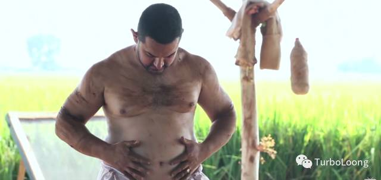

 　　过去一年我做过很多事情，学习过英语，研究过angular源码，练习过吉他，健身房健过身，学习过算法，金融经济学，每一项都是不错的技能，可是每一项到最后我都没坚持下去，仅仅是做过，却没有做好过。

 　　当仅仅研究到angular源码的启动过程，发现对技术水平的提升没有任何效果，我放弃了；当健身3个月，虽然家人也说我变瘦了，就是肚子还没减下去，我放弃了；当练习吉他两首曲子，再也没有提高，我放弃了；当看完《经济学原理》，还是看不懂财经数据，我放弃了。当发现努力了一段时间没有任何效果的时候，我放弃了。

 　　我总是急于求成。当看到我的努力没有获得回报，就放弃了努力。

 　　大家看过一段陈道明在"传承者"发飙的视频吧。他讲到

　　在我学习的那些技能，我耐不住寂寞，我真的太着急了，着急看到收获，着急看到成果。而Ray Kroc52岁才创立了麦当劳，川普70岁才当上总统，张嘉译1990参演电影，2009才在“蜗居”中火。可是Ray Kroc做推销员坚持了30年，张嘉译安静了19年，而我每次都没坚持超过三个月。

　　如果当初坚持研究完angular源码，坚持学习前端，现在我的工资应该在7000左右吧；如果当初坚持练习吉他，现在我应该会谈5，6首歌曲了吧；如果当初坚持健身，现在我应该没有大肚子了吧；

　　如果当初坚持学习算法，现在我应该进入大数据学习了吧；如果当初坚持学习英语，现在我应该能在川大的英语角和老外侃侃而谈了吧。

　　当认准了做完一件事的确对自己帮助很大，就应该踏踏实实，努力坚持学完，不要为了短暂的毫无效果而忧虑。凡事总有个过程，我们只需要在认准的道路上耐住寂寞，持续努力，我相信一切的结果都是自然而然的事。

　　好了，现在我知道怎么做了，继续研究angular源码，每天关注前端动态，开始学习后端知识，包括java，MySQL, linux，每天还要坚持读书，我又办了张20个月的健身卡，每周坚持两次去健身房。

