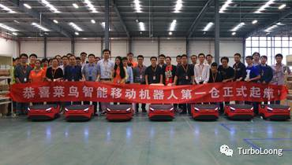
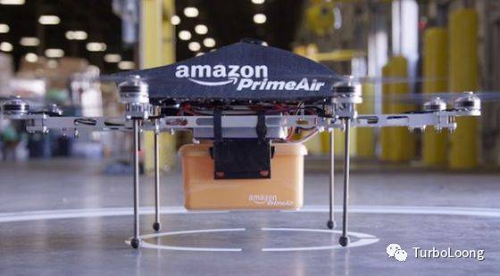

　　前段时间买了份保险，需要父母的身份证复印件，我以为很简单，找老爸把身份证拍下来用微信发给我就行了。可没想到我爸爸不会用智能手机，我以前也叫他用智能手机，教他用，可他说用直板手机用习惯了，又担心智能手机复杂，不想用。我又问他身边有没有人用微信，可惜也没人。我今天想谈论的不是我爸爸没勇气离开他的舒适区，而是这类不愿去学习新事物，而逐渐被这个不断进步的时代淘汰的人。

　　我从事的行业是IT互联网，本是一个日新月异的行业，而我似乎也没有紧随它的脚步。

　　共享经济已经开始，从滴滴，到共享单车，现在共享雨伞和充电宝也有了，现在在共享经济还是一大片蓝海，很多剩余价值亟待挖掘；工业4.0已经到来，机器和数据结合，工厂自动化越来越高，看看上个月的汉诺威工业展览会，就知道如今的工厂正在发生什么，富士康现在每年都在裁员；人工智能，大数据也来了，华尔街越来越多证券分析师失业，amazon和菜鸟物流的包裹分发已经有机器人开始介入，Amazon的包裹已经有无人机开始运送。

　　这些技术在逼迫着人离开公司，离开工厂。按李开复的说法，未来10年会有90%的人失业，而我正生活在这个年代，不管这是不是危言耸听，还是有一种危机感。那么问题来了，我们人去哪？我的答案就是我们自己。从微信公众号，微博，直播，网红，知乎专栏，喜马拉雅，得到，这上面注册的每个用户都不是一家公司，而是一个人。过去，很多人都有其特长，但常常没有足够大的地方展示自己，而现在，有越来越多台。以前我们的收入大部分取决于工资，我们能发挥专业技能的地方只有公司，而现在，越来越多的人离开公司，将工作重点转移到各种平台。就像我的沈阳朋友，从大二开始，她喜欢美瞳，在微博上拥有很多粉丝，做美瞳生意，每个月有四五千的收益。现在的社会正从“部落”到“个体”发展。

　　但很遗憾，我身在其中却毫无意识到，微博8年，微信公众号5年，2016是直播元年。看看那些原本是普通人，在微博刚出来就开始玩，现在至少也有几百万的粉丝吧。在公众号出来就开始写文章的人，现在的文章不知道写了多少，有多少订阅用户。我看新闻有一个人直播睡觉也引来三四万的围观，还有一两万的打赏。有人直播剪断共享单车的私人锁，获得5，6万的打赏。现在想在这些平台获得更多的粉丝已经很难了，早就被提前进入的人分割完了。这个时代每隔一段时间就有一个风口，人一生会经历很多风口，只要能抓住就那么一次，能飞起来，即使最后风停了，掉下来，摔得很疼，那也比老老实实地打工强百倍。而我的反应却那么迟，就像百度对移动互联网的反应一样，当移动的社会到来的时候，百度仍然沉迷在自己搜索老大的地位。看看百度近年来的股票情况吧，这就是没有紧跟时机的下场。哎，要说下场应该说搜狐，其创始人还曾被誉为“创业教父”，而现在，搜狐恐怕最值钱的不是它的股票，是搜狐媒体大楼。

　　时代正在从“部落”到“个人”，我毕业第二年的目标就是成为自由职业者，离开旧有的雇佣关系的体制。每一次的技术革命都会淘汰一部分人，只有紧跟时代走向，顺势而为的人才会留下，未来已来。

　　全球化的冬天已经到来，反全球化的声音越来越大，下一个时代的春天还会远吗？

