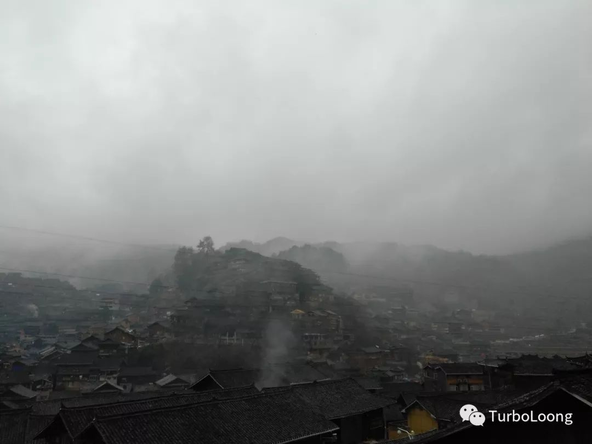
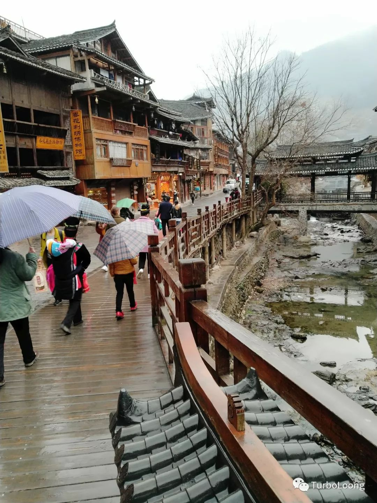

   早上起床看见寨子下起了蒙蒙的细雨

，我在走出寨子的时候看见好多女孩和大姐进寨子

，她们都是附近来景区打工的。

　　在走出门口时，就有黑车司机拉客，叫喝着“凯里凯里”。我本打算去做旅游专线的，顺便问了下司机价钱，30/人，便宜5块钱。看了下车，是小轿车，比旅游专线的面包车舒服，我就上了车。

　　在凑好3个人后就出发了，路上就和司机聊起了天，问了下寨子的情况。这一问，我伤透了心。司机是苗寨旁边的人，他是看着苗寨被开发的。他说你逛的古街，根本不是以前的，全是用混泥土重新修过的。那些商铺，卖银饰，刺绣，牛角梳等等，都不是本地人，全是外来商人，一个店铺的租金就是一万多，像牛角梳，酥糖以前根本没有。想想也是，贵州在我们印象中是什么样，大家都知道，当地人哪来的钱支付这昂贵的房租。那当地人去哪了，你走进饭店，那些服务员，门口吹芦笙的男人，街上打扫卫生的环卫工人，这些干着初级苦力的工作才是本地人。我说那表演场的表演呢？司机说根本就不是苗族舞，连跳舞的女孩都不是本地人（想到昨天我还争过去和跳舞的女孩合影，这多么打脸），为了增加观赏性，那些舞蹈也是重新编排过的。我又问银饰呢？是不是最近有着“银匠村”之称，还被收录为国家非物质遗产名录的控拜村制造的？司机说那里都很少人了，早就不制作了，景区里面的银饰全是从凯里批发进货的，你去凯里买比这便宜多了。

　　我这才明白，当我进入寨子的第一步，看到的全是假的。想想昨天刚进寨子满怀期待的心情，之前做好的自认为完美的计划，真的好伤心。这就像唐三藏进入了一个红孩儿设计的富丽堂皇的寺庙一样，当孙悟空揭穿时才发现寺庙破烂不堪，还全是妖怪的雕塑；就像我真心诚意地爱上了一个女孩，相处了一段时间发现她是骗我的。什么是真的？只有这蓝天白云，青山绿水才是真的。而当我回到成都，蓝天也会消失。

　　我就想问，中国的旅游景点还有真的吗？

